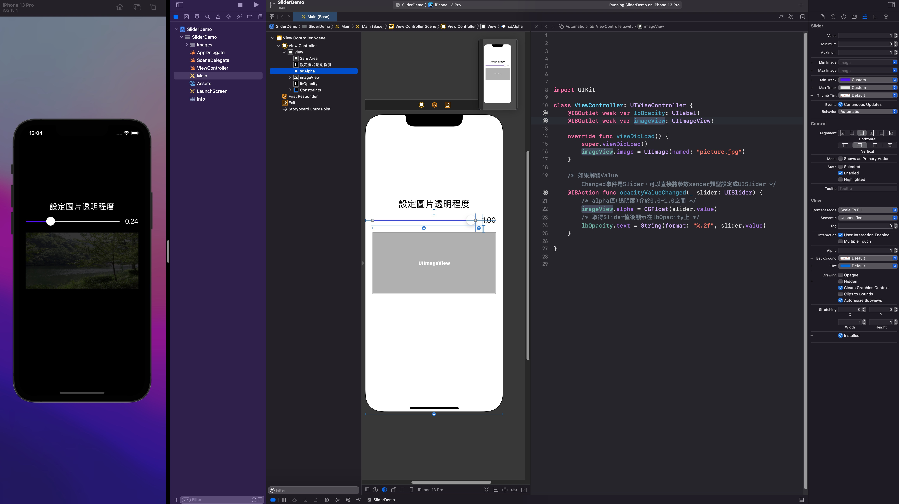

# IOS Note

記錄ios開發
# 使用設備及環境

- Mac mini M1
- MacBook Air M1
- macOS Monterey 12.2.1
- XCode
- iPhone Xs Max

# XCODE

偏好設定，可以設定字型大小之類的個人化設定

運行程序，可以選擇實體機或模擬器

模擬器

xcode編輯畫面

完整畫面

第一次連接要使用實體線，並在手機上給予權限

使用手機連接需先登入apple id

手機狀態，點擊connect via network，之後可以透過網路傳輸執行畫面

連接實體機運行

利用QuickTime Player可以將實體機畫面展示在mac上

選擇iphone

成功展示ipohne畫面

app icon

# 常用UI元件

## Stack View

## UI元件連結與事件處理

## 虛擬鍵盤事件處理

## UI元件顯示與隱藏

## 螢幕淺色與深色模式

## Image View呈現圖片

## Image View載入圖片

## Scroll View

## 程式建立Scroll View

## Slider

## Switch

內建並沒有像網頁checkbox、radiobox的UI

## Segmented Control區段選項

## Date Picker

## Picker View

## WebView

